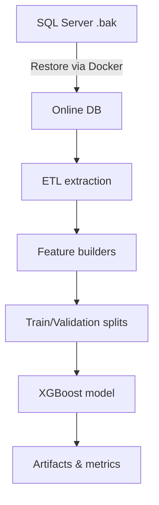

# 🏥 PharmacyStore Forecasting

> End-to-end pipeline to forecast weekly unique prescriptions (UPW) for Iranian pharmacies using XGBoost on tabular data.

## Table of contents
1. [Why it matters](#why-it-matters)
2. [Data requirements](#data-requirements)
3. [Repository at a glance](#repository-at-a-glance)
4. [Quick start](#quick-start)
5. [Execution flow](#execution-flow-run_allpy)
6. [Architecture overview](#architecture-overview)
7. [Manual commands](#manual-commands)
8. [Configuration](#configuration-env)
9. [Feature engineering](#feature-engineering)
10. [Forecast target & evaluation](#forecast-target--evaluation)
11. [Outputs](#outputs)
12. [Reproducibility](#reproducibility)
13. [Operational maturity checklist](#operational-maturity-checklist)
14. [Troubleshooting](#troubleshooting)
15. [انتقال تغییرات به ریپوی اصلی](#انتقال-تغییرات-به-ریپوی-اصلی)
16. [Credits & maintenance](#credits--maintenance)

## Why it matters
- Automates extraction from SQL Server backups and builds a repeatable training dataset.
- Feature-rich weekly signals: rolling stats, ATC classification, holiday effects, and sales/price bands.
- Walk-forward evaluation with classic baselines (naïve, moving average, seasonal naïve).

## Data requirements
> ⚠️ **For stable generalization, plan for a minimum of three years of pharmacy transaction data** (prescriptions, prices, ATC metadata, and holiday calendars). Shorter horizons (e.g., the current 10-month sample) limit the ability to model seasonality and rare drugs effectively.

Required external files:
- Exactly one `.bak` file in `data/external/` (restored into SQL Server).
- `data/external/who_atc_ddd.csv`.
- `data/external/holidays/weekly_official_holidays.csv`.
- Optional: `data/external/holidays/persian_holidays.csv`.

## Repository at a glance
- `src/pharmacystore/`: core package (SQL client, feature builders, models, pipeline entry points).
- `scripts/`: runnable utilities (restore wrapper, CLI entry point for the pipeline).
- `restore_mssql_docker.sh` / `restore_mssql_docker.ps1`: Docker-based SQL restore (Linux/Windows).
- `data/processed/`, `artifacts/`: generated datasets, trained models, per-run metrics (gitignored).

## Quick start
1. Place exactly one `.bak` in `data/external/`.
2. Run `python run_all.py`.
3. When prompted, enter the SQL Server SA password (not stored on disk).
4. Outputs land in `data/processed/` and `artifacts/`.

### Execution flow (`run_all.py`)
1. `run_all.py` (root) delegates to `scripts/run_all.py`.
2. Passwords are exported to env vars for this process only:
   - `SQL_PASS` (restore scripts)
   - `PHARMACYSTORE_SQL_PASSWORD` (pipeline)
3. Restore step (OS-specific):
   - **Windows:** `powershell -ExecutionPolicy Bypass -File .\restore_mssql_docker.ps1 -DB_NAME PharmacyStore`
   - **Linux:** `bash scripts/restore_db.sh` → `restore_mssql_docker.sh PharmacyStore`
4. Restore script actions:
   - Creates/recreates Docker container `mssql_restore` (SQL Server 2022) mapping host `14333` → container `1433`.
   - Copies the single `.bak` from `data/external/` into the container.
   - Detects logical names via `RESTORE FILELISTONLY`, restores with `REPLACE`, returns to `MULTI_USER`.
   - Updates `.env` with connection settings (except the password).
5. `scripts/run_all.py` validates required files and installs dependencies.
6. Runs `python -m pharmacystore.pipeline full` to extract data, build features, train models, and export artifacts.

## Architecture overview

- **Extract**: pull core pharmacy tables from the restored SQL Server database.
- **Transform**: derive calendar, holiday, price, and ATC-driven features with leakage-safe splits.
- **Model**: train XGBoost with walk-forward evaluation and baselines; export metrics and serialized artifacts.
- **Operate**: scripts wrap the workflow (`run_all.py`, `scripts/run_all.py`) with environment-driven settings.

## Manual commands
- Build weekly features: `python -m pharmacystore.pipeline run`
- Train main XGBoost: `python -m pharmacystore.pipeline train`
- Train baseline XGBoost: `python -m pharmacystore.pipeline train-baseline`
- Full pipeline: `python -m pharmacystore.pipeline full`
- Optional run tag: append `--run-tag exp1` to training commands.

Legacy scripts (still supported):
- `python scripts/run_pipeline.py`
- `python scripts/train_model.py`
- `python scripts/train_baseline.py`
- `python scripts/scale_sales.py`
- `python scripts/classify_atc.py`

## Configuration (.env)
Set via environment or `.env` (see `.env.example`):

**Required**
- `PHARMACYSTORE_SQL_SERVER`
- `PHARMACYSTORE_SQL_DATABASE`
- `PHARMACYSTORE_SQL_USERNAME`
- `PHARMACYSTORE_SQL_PASSWORD`

**Defaults (Docker restore)**
- `PHARMACYSTORE_SQL_SERVER=localhost,14333` (note the comma for port)
- `PHARMACYSTORE_SQL_DATABASE=PharmacyStore`
- `PHARMACYSTORE_SQL_USERNAME=sa`
- `PHARMACYSTORE_SQL_DRIVER=ODBC Driver 18 for SQL Server`
- `PHARMACYSTORE_SQL_ENCRYPT=false`
- `PHARMACYSTORE_SQL_TRUST_CERT=true`

Password handling: restore scripts never persist the password; `run_all.py` passes it via environment variables.

## Feature engineering
- Weekly aggregation: `UPW = nunique(PrID)` per `DrugId` and `week_start` (Monday bucket).
- Calendar signals: week-of-year, month, quarter, start/end flags.
- Holiday signals: weekly official holiday counts (if data provided).
- ATC classification: normalized ATC codes and groupings.
- Sales/price categories: derived on a training subset to avoid leakage.
- Rolling stats: lagged UPW, rolling means/stds, trend, and z-scores.

## Forecast target & evaluation
| Component | Standard |
| --- | --- |
| Target (UPW) | Weekly unique prescriptions per drug: `UPW = nunique(PrID)` aggregated by `DrugId` and `week_start`, filtered to `SalePrice > 0`. |
| Time split | Train = oldest weeks, validation = middle weeks, test = newest weeks (70/15/15 by week). |
| Baselines | Naive (last week), moving average (last 4 weeks), seasonal naive (t-52 weeks, if available). |
| Metrics | MAE, RMSE, WAPE, sMAPE. |

## Outputs
- `data/processed/weekly_features.csv`: weekly feature dataset.
- `data/processed/upw_valid_predictions.csv`: validation predictions.
- `data/processed/upw_walkforward_predictions.csv`: walk-forward backtest (optional).
- `data/processed/upw_fold_drift.csv`: drift diagnostics (train vs valid).
- `artifacts/models/upw_xgb_model.json`: latest trained model.
- `artifacts/runs/<run_id>/`: run configs, metrics, predictions, diagnostics.

## Reproducibility
- Fixed seeds for numpy/random/xgboost via `PHARMACYSTORE_RANDOM_SEED`.
- Each run writes to `artifacts/runs/<run_id>/` with `config.json`, `train_params.json`, `metrics.json`, `data_manifest.json`, and per-run outputs.
- Metrics also exported to `artifacts/metrics/<run_id>/metrics.json`.
- `data_manifest.json` records dataset hash and train/test week ranges.

## Operational maturity checklist
- [ ] Add CI with linting/type checks (e.g., `ruff`, `mypy`) and unit tests for feature builders and SQL client.
- [ ] Introduce structured logging and runtime metrics to replace ad-hoc prints.
- [ ] Add data-quality validation on extracted tables (schema + row-level guards).
- [ ] Publish a model card summarizing data sources, assumptions, and evaluation splits.
- [ ] Provide a minimal inference/demo notebook for stakeholders.

## Troubleshooting
- pip SSL errors: verify system time/CA certs; try `python -m pip install -U pip setuptools wheel`.
- `Cannot open database ... (4060)`: ensure Docker container is running and `.env` DB name matches.
- "No .bak file found": ensure exactly one `.bak` exists in `data/external/`.
- Missing ODBC driver: install "ODBC Driver 18 for SQL Server" on host.

## Credits & maintenance
- Python >= 3.11, dependencies in `pyproject.toml` / `requirements.txt`.
- Data and model artifacts are gitignored (`data/processed/`, `artifacts/`).
